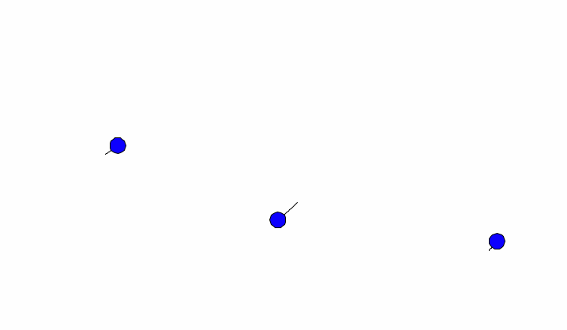

# N-Body Gravitational Simulator

A real-time gravitational simulator built from scratch in Python, inspired by 
Liu Cixin's The Three-Body Problem. Simulates any number of bodies interacting 
via Newtonian gravity, with no physics libraries, all mechanics implemented manually.



## Features
- Simulate any number of bodies with custom mass, position, and velocity
- Save and load simulation presets
- Built in astronomical presets including the Earth Moon system and the 
  famous figure 8 three-body solution
- Add bodies mid simulation

## Physics
Each time step computes gravitational forces using Newton's law of 
universal gravitation, then updates velocities and positions with Euler integration.

## How to run
```bash
python main.py
```

## Built with
Python, Tkinter, no other external libraries

## Time line
Originally created in 2024, at 14 years old.
